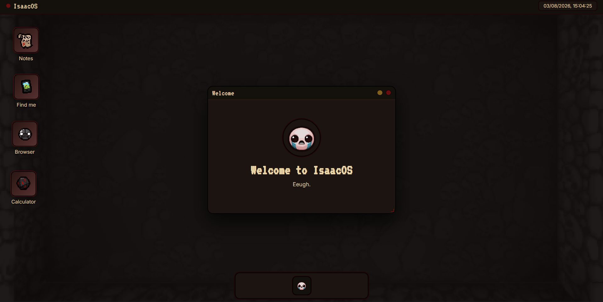

# Webbandola

This is a project that was made using only HTML, CSS, JS. It is a webOS inspired by The Binding of Isaac where every app is based on an item from the game. rn it only has 5 apps, the welcome app, the notes app, the find me app, the browser app and the calculator app. there are more apps on the way but i will add them later. i also made a dock with various animations (i thank deepseek for this) and a clock on the top right.

https://pickledroided.github.io/webbandola/

---

## Preview

---

## The Idea

i always liked operating system customization (even tho rn it doesn't have many but it's just a demo), but i wanted something more personal and unique and rn my obsession game is isaac so this was the first idea i had in mind. i also wanted to try some css animations but couldn't get them right so i asked deepseek for help and i am pretty happy with the result.

## Credits

- Shoutout to DeepSeek v4 FLASH for the css animations
- [DietrichGebert/ponytail](https://github.com/DietrichGebert/ponytail) for keeping the code minimal
- The **Stardance** community for the opportunity :3
